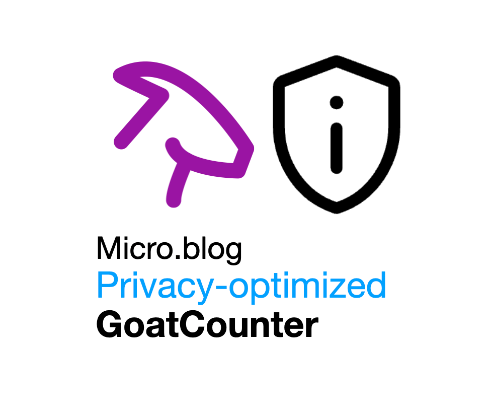

# Privacy-optimized web analytics with GoatCounter for Micro.blog

This plugin adds privacy-friendly, lightweight analytics to your Micro.blog site using [GoatCounter](https://www.goatcounter.com). It uses a tracking pixel and optionally includes inline JavaScript to enhance the tracking with HTTP referrer data, without relying on cookies or any third-party scripts. You need to have a free GoatCounter account to use this plugin.

## ✅ Features

- Static tracking pixel (``) with page path and title
- Optional inline JavaScript to include the HTTP referrer
- Works with [GoatCounter vanity URLs](https://www.goatcounter.com/help/faq#custom-domain)
- Fully GDPR-friendly: No cookies, no third-party tracking, no fingerprinting

## 🛠 How It Works
1. A tracking request is sent to your GoatCounter domain with the current page path and title.
2. If JavaScript tracking is enabled and the visitor came from an external site, the referrer is added.
3. If JavaScript is disabled or blocked, a `<noscript>` fallback ensures basic page view tracking still works.

## ⚙️ Setup
1. Register and setup your free [GoatCounter](https://www.goatcounter.com).
2. Optional: Create a free [GoatCounter vanity URL](https://www.goatcounter.com/help/faq#custom-domain)
3. Go to the Micro.blog plugin directory and install the plugin from there.
4. Include the tracking partial `{{ partial "goatcounter.html" . }}` in the footer.html of your theme, or wherever appropriate.
5. Go to the plugin settings and enter your tracking domain, e.g. `https://name.goatcounter.com` or `https://stats.example.com`. Ensure you enter the full URL including `https://` and without `/count`.
6. Optional: Enable inline JavaScript for sending the referrer to GoatCounter

### ⚠️ Limitations
This plugin uses a privacy-focused implementation of GoatCounter with **no external JavaScript** from GoatCounter itself. This design respects user privacy but comes with a few important limitations:

- **No JavaScript = limited data**  
  Without the official GoatCounter JS, only basic pageview tracking is available via image requests or inline scripts. This means you can only track:
  - Page paths
  - Page titles
  - Optional referrer (when local JS is enabled)

  You won’t see data about:
  - Operating systems (e.g., macOS, Windows)
  - Browsers (e.g., Chrome, Safari)
  - Device types or screen sizes
  - Language of your visitor
  - Country of your visitor

- **Referrer tracking is optional and limited**  
  If you activate the inline JS, the plugin tries to capture `document.referrer` using local JavaScript.
  - Referrers from the same hostname are ignored
  - Only works if the user has JavaScript enabled

- **Requires a vanity domain**  
  You must use your own GoatCounter domain (e.g. `https://stats.example.com`). Using the default `*.goatcounter.com` URL may not work due to CORS restrictions.

## 👤 Author
René Fischer – [https://fischr.org](https://fischr.org)
