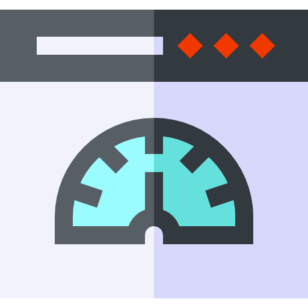

# GoatCounter for Micro.blog

Privacy-friendly web analytics for your Micro.blog site using [GoatCounter](https://www.goatcounter.com). No cookies, no tracking, GDPR-friendly.

## Setup

1. Create a free [GoatCounter](https://www.goatcounter.com) account
2. Install this plugin from the Micro.blog plugin directory
3. Enter your GoatCounter URL in the plugin settings (e.g. `https://name.goatcounter.com`)
4. Add `{{ partial "goatcounter.html" . }}` to (any of) your theme's footer (before `</body>`)

Choose between JavaScript tracking (full analytics) or pixel-only mode (page views only) in the plugin settings.

## Author
René Fischer – [https://fischr.org](https://fischr.org)
